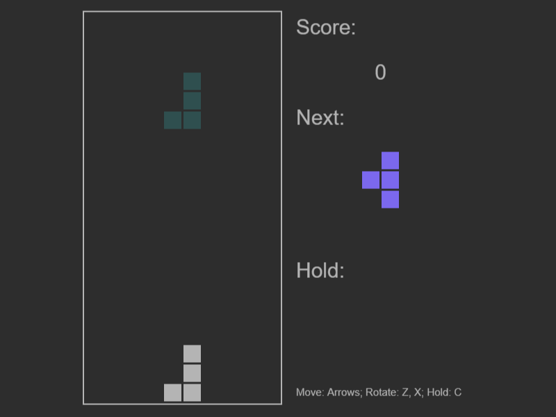

# TypeScriptTetrisClone
Simple Tetris game for TypeScript practice and giggles.  

[Live Demo](https://mihgol.github.io/TypeScriptTetrisClone/)

To build type:
```
tsc
```

Add tetris.js to your HTML file and create new instance of Tetris.Game,
which takes DOM Element as parameter, eg. document.body to place it inside body.

```
<script src="tetris.js"></script>
<script>
    new Tetris.Game(document.body);
</script>
```
## Controls:  
<kbd>↑</kbd> or <kbd>X</kbd>    = Rotate Right  
<kbd>↓</kbd>    = Move Down  
<kbd>←</kbd>    = Move Left  
<kbd>→</kbd>    = Move Right  
<kbd>C</kbd>    = Hold / Swap Tetromino  
<kbd>Space</kbd> = Instant Drop  


